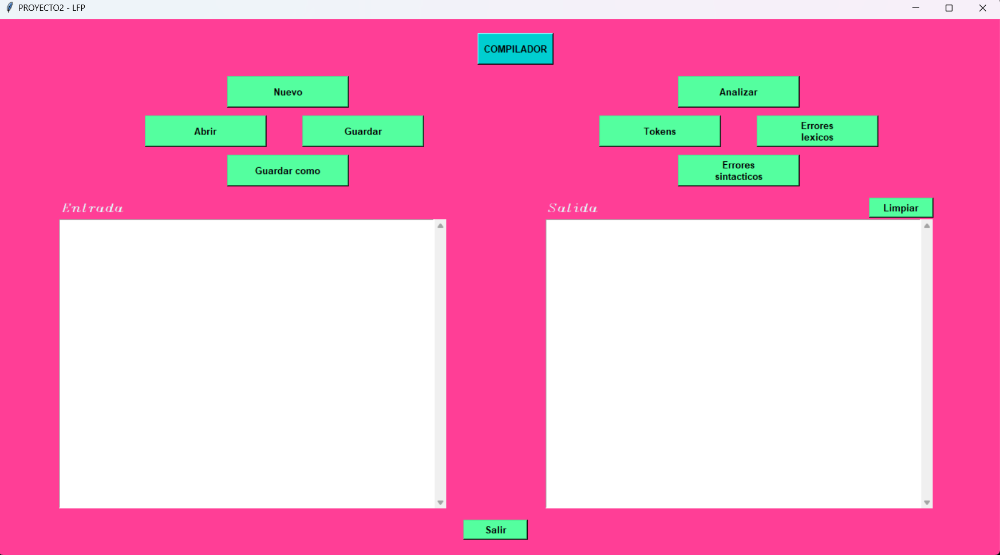

# 
 Manual De Usuario 

## 
 Uso del programa 

##### **Menu principal:** al momento de ejecutar el programa el usuario visualizara una interfaz grafica con las diferentes opciones que cuenta el programa para la interaccion con el mismo.

**
Menu principal
** 

##### **Abrir:** esta opcion le permitira al usuario abrir un archivo con cualquier extension y podra visualizar el contenido del archivo en area de texto entrada.

**
Abrir
** 

##### **Nuevo:** esta opcion permitira al usuario abrir un nuevo archivo cuando lo desee.

##### **Guardar:** esta opcion le permitira al usuario guardar el archivo que se encuentra en ejecucion y los cambios realizados en el area de texto entrada.

##### **Guardar como:** esta opcion le permitira al usuario guardar el archivo con los cambios realizados con el nombre que desee.

##### **Analizar:** esta opcion analizara el contenido que se encuentre en el area de texto entrada, analizara si el contenido tiene errores lexicos o sintacticos y verificara que el archivo tenga una estructura correcta, si es asi devolvera un respuestra en el area de texto salida.

**
 Analizar 
**

##### **Tokens:** esta opcion permitira visualizar los tokens que el programa detecto y guardo del archivo que fue analizando y permitira visualizar esos tokens en una tabla en formato png.

**
 Tokens 
**

##### **Errores lexicos:** esta opcion le permitira al usuario ver los errores lexicos que el programa detecto durante el analisis y los desplegara en una tabla.

**
 Errores lexicos 
**

##### **Errores sintacticos:** esta opcion le permitira al usuario visualizar los errores sintacticos que el programa detecto durante el analisis y los mostrar en un tabla.

**
 Errores sintactico 
**

##### **Limpiar:** esta opcion le permitira al usuario limpiar el area de texto de salida.

##### **Salir:** esta opcion cerrara por completo el programa.