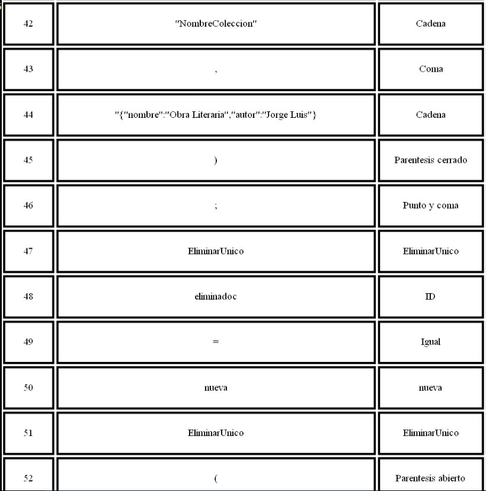

# <center>Manual Tecnico</center> 
# <center>Programa</center>
**<center>Analizador lexico</center>**

##### **Clase analizador:** mediante la creacion de esta clase y la creacion de sus metodos podemos verficar los diferentes caracteres y palabras reservadas que el programa puede interpretar, toda palabra o caracter que sea desconocida o no pueda ser interpretada por el programa sera tomada o interpretada como un error lexico.

```python
class Analizador_l:
    def __init__(self):
        self.tokens = []
        self.errores = []
        self.linea = 1
        self.columna = 1
        self.estado_actual = 0
        self.puntero = ''
```

##### **Metodo guardar errores:** este metodo guardara todos los caracteres interpretado como errores que el programa encuentre en su ejecucion ademas guardara la linea y la columna en la que este caracter se encuentre.

```python
def guardar_errores(self, caracter):
        self.errores.append(Error(f'Caracter invalido: {caracter}', self.linea, self.columna))
```

##### **Metodo guardar tokens:** este metodo guardara todos los tokens y los lexemas que el programa puede interpretar al igual que las palabras reservadas ademas de que tambien guardara la o las lines y columnas en la que estas se encuentran.

```python
def guardar_token(self, tipo, token):
        self.tokens.append(Token(tipo, token, self.linea, self.columna))
        self.indice -= 1
```
##### **Metodo visualizar errores:** este metodo devolvera una tabla con los errores encontrados por el programa la linea y la columna en la que se encontro el error.

```python
def visualizar_errores(self):
        archivo = open('errores.dot', 'w')
        archivo.write('digraph G {a0[shape=none label=<<TABLE align="center" border="3" cellspacing="3" cellpadding="20">')
        archivo.write('<TR><TD><FONT FACE="bold">No.</FONT></TD><TD><FONT FACE="bold">Descripcion</FONT></TD><TD><FONT FACE="bold">Linea</FONT></TD><TD><FONT FACE="bold">Columna</FONT></TD></TR>')
        print('Errores')
        contador = 0
        for error in self.errores:
            print(f'Tipo de error: {error.caracter}, Fila: {error.linea}, Columna: {error.columna}')
            contador += 1
            archivo.write('<TR><TD>' + str(contador) + '</TD><TD>' + str(error.caracter) + '</TD><TD>' + str(error.linea) + '</TD><TD>' + str(error.columna) + '</TD></TR>')

        archivo.write('</TABLE>>];}')
        archivo.close()
        os.system('dot.exe -Tpng errores.dot -o errores.png')
        os.startfile('errores.png')
```
##### **Metodo visualizar token:** este metodo al igual que el metodo visualizar errores devolvera una tabla pero con los diferentes tokens y lexemas que el programa puede interpretar durante la ejecucion de el mismo ademas de que tambien devolvera la linea y columna donde se encuentran estos tokens y lexemas.

```python
def visualizar_token(self):
        archivo2 = open('tokens.dot', 'w')
        archivo2.write('digraph G {')
        archivo2.write('Start[label="", shape=none]\n')
        archivo2.write('a0[shape=none label=<<TABLE align="center" border="3" cellspacing="3" cellpadding="20">')
        archivo2.write('<TR><TD><FONT FACE="bold">No.</FONT></TD><TD><FONT FACE="bold">Lexema</FONT></TD><TD><FONT FACE="bold">Token</FONT></TD><TD><FONT FACE="bold">Linea</FONT></TD><TD><FONT FACE="bold">Columna</FONT></TD></TR>')
        print('Tokens')
        contador_token = 0
        for token in self.tokens:
            print(f'Token: {token.puntero}, Tipo: {token.tipo}, Fila: {token.linea}, Columna: {token.columna}')
            contador_token += 1
            archivo2.write('<TR><TD>' + str(contador_token) + '</TD><TD>' + str(token.puntero) + '</TD><TD>' + str(token.tipo) + '</TD><TD>' + str(token.linea) +  '</TD><TD>' + str(token.columna) + '</TD></TR>')

        archivo2.write('</TABLE>>];}')
        archivo2.close()
        os.system('dot.exe -Tpng tokens.dot -o tokens.png')
        print(os.getcwd()) 
        os.startfile('tokens.png')
```
##### **Metodo estado_0:** este metodo es el inicio de todo, por medio de este metodo el programa podra ir verificando los diferentes tokens que puede interpretar si en algun caso algun token no esta definido en este metodo, se guardar como error de lo contrario se guardara en la lista de tokens.

```python
def estado_0(self, caracter):
        if caracter == '-':
            self.estado_actual = 1
            self.columna += 1
            self.puntero += caracter
        elif caracter == '/':
            self.estado_actual = 6
            self.columna += 1
            self.puntero += caracter
        elif caracter.isalpha():
            self.estado_actual = 11
            self.columna += 1
            self.puntero += caracter
        elif caracter == '=':
            self.estado_actual = 12
            self.columna += 1
            self.puntero += caracter
        elif caracter == '(':
            self.estado_actual = 13
            self.columna += 1
            self.puntero += caracter
        elif caracter == ')':
            self.estado_actual = 14
            self.columna += 1
            self.puntero += caracter
        elif caracter == ';':
            self.estado_actual = 15
            self.columna += 1
            self.puntero += caracter
        elif caracter == ',':
            self.estado_actual = 16
            self.columna += 1
            self.puntero += caracter
        elif caracter == '"':
            self.estado_actual = 17
            self.columna += 1
            self.puntero += caracter 
        elif caracter in [' ']:
            self.columna += 1
        elif caracter == '\n':
            self.columna = 1
            self.linea += 1
        elif caracter == '#':
            pass
        else:
            self.guardar_errores(caracter)
            self.estado_actual = 0
            self.columna += 1
            self.puntero = ''
```
##### **Metodo estado_1:** este estado ira verificando los tokens para poder ir creando un comentario de una o varias lineas esta misma logica se estara empleando desde este estado hasta el estado_10 el cual lo unico que hara cada estado es verificar que se cumpla con la sintaxis correcta y asi crear el comentario, de lo contrario si el programa encuentra alguna token que no este definido en el estado_0 sera tomado como error.

```python
def estado_1(self, caracter):
        if caracter == '-':
            self.estado_actual = 2
            self.columna += 1
            self.puntero += caracter
        else:
            self.guardar_errores(self.puntero)
            self.estado_actual = 0
            self.columna += 1
            self.puntero = ''  

    def estado_2(self, caracter):
        if caracter == '-':
            self.estado_actual = 3
            self.columna += 1
            self.puntero += caracter
        else:
            self.guardar_errores(self.puntero)
            self.estado_actual = 0
            self.columna += 1
            self.puntero = ''

    def estado_3(self, caracter):
        if caracter != '\n':
            self.estado_actual = 4
            self.columna += 1
            self.puntero += caracter
        else:
            #print(f'{self.puntero}')
            self.estado_actual = 5
            self.columna += 1
            self.linea += 1
            #self.puntero = ''     
    
    def estado_4(self, caracter):
        if caracter != '\n':
            self.estado_actual = 4
            self.columna += 1
            self.puntero += caracter
        else:
            #print(f'{self.puntero}')
            self.estado_actual = 5
            self.columna = 1
            self.linea += 1
            #self.puntero = ''

    def estado_5(self):
        print('Comnetario de una sola linea')
        self.estado_actual = 0
        self.indice -= 1
        self.puntero = ''
        #self.estado_actual = 0
    
    def estado_6(self, caracter):
        if caracter == '*':
            self.estado_actual = 7
            self.columna += 1
            self.puntero += caracter
        else:
            self.guardar_errores(self.puntero)
            self.estado_actual = 0
            self.columna += 1
            self.puntero = ''

    def estado_7(self, caracter):
        if caracter != '*':
            self.estado_actual = 8
            self.columna += 1
            self.puntero += caracter
        else:
            self.estado_actual = 9
            self.columna += 1
            self.puntero = ''
    
    def estado_8(self, caracter):
        if caracter != '*':
            self.estado_actual = 8
            self.columna += 1
            self.puntero += caracter
        else:
            self.estado_actual = 9
            self.columna += 1
            self.puntero = ''

    def estado_9(self, caracter):
        if caracter != '/':
            self.estado_actual = 8
            self.columna += 1
            self.puntero += caracter
        else:
            self.estado_actual = 10
            self.columna += 1
            self.puntero = ''
    
    def estado_10(self):
        print('Comentario de varias lineas')
        self.estado_actual = 0
        self.columna += 1
        self.puntero = ''
```
##### **Metodo estado_11:** este metodo ira verificando mediante una lista las palabras reservadas que el programa podra interpretar durante la ejecucion de este mismo.

```python
def estado_11(self, caracter):
        if caracter.isalpha():
            self.estado_actual == 11
            self.columna += 1
            self.puntero += caracter
        else:
            if self.puntero in ['CrearBD', 'EliminarBD', 'CrearColeccion', 'EliminarColeccion', 'InsertarUnico', 'ActualizarUnico', 'EliminarUnico', 'BuscarTodo', 'BuscarUnico', 'nueva']:
                if self.puntero == 'CrearBD':
                    self.guardar_token(f'CrearBD', self.puntero)
                elif self.puntero == 'EliminarBD':
                    self.guardar_token(f'EliminarBD', self.puntero)
                elif self.puntero == 'CrearColeccion':
                    self.guardar_token(f'CrearColeccion', self.puntero)
                elif self.puntero == 'EliminarColeccion':
                    self.guardar_token(f'EliminarColeccion', self.puntero)
                elif self.puntero == 'InsertarUnico':
                    self.guardar_token(f'InsertarUnico', self.puntero)
                elif self.puntero == 'ActualizarUnico':
                    self.guardar_token(f'ActualizarUnico', self.puntero)
                elif self.puntero == 'EliminarUnico':
                    self.guardar_token(f'EliminarUnico', self.puntero)
                elif self.puntero == 'BuscarTodo':
                    self.guardar_token(f'BuscarTodo', self.puntero)
                elif self.puntero == 'BuscarUnico':
                    self.guardar_token(f'BuscarUnico', self.puntero)
                elif self.puntero == 'nueva':
                    self.guardar_token(f'nueva', self.puntero)
                # self.guardar_token(f'Reservada', self.puntero) # Cambios
                self.puntero = ''
                self.estado_actual = 0
            else:
                self.guardar_token('ID', self.puntero)
                self.puntero = ''
                self.estado_actual = 0
```
##### **Metodo estado_12:** este estado ira verificando y guardando tokens y lexemas que el programa podra interpretar y concatenadolo al puntero es cual siempre almacenada una cadena completa con los tokens y lexemas guardados, esta misma logica se aplica desde este estado hasta el estado_22 y por medio de estos metodos se podran ir formando las diferentes cadenas y concatenandose con las diferentes palabras reservadas ademas que tambien se iran verificando de que sean caracteres validos o cadenas validas.

```python
def estado_12(self):
        self.guardar_token('Igual', self.puntero)
        self.puntero = ''
        self.estado_actual = 0

    def estado_13(self):
        self.guardar_token('Parentesis abierto', self.puntero)
        self.puntero = ''
        self.estado_actual = 0

    def estado_14(self):
        self.guardar_token('Parentesis cerrado', self.puntero)
        self.puntero = ''
        self.estado_actual = 0

    def estado_15(self):
        self.guardar_token('Punto y coma', self.puntero)
        self.puntero = ''
        self.estado_actual = 0
    
    def estado_16(self):
        self.guardar_token('Coma', self.puntero)
        self.puntero = ''
        self.estado_actual = 0
    
    def estado_17(self, caracter):
        if caracter != '"':
            if caracter == '\n':
                self.estado_actual = 17
                self.linea += 1
                self.columna = 1
            elif caracter == '{':
                self.estado_actual = 20
                self.puntero += caracter # ------------Coreccion
            else:
                self.estado_actual = 18
                self.puntero += caracter
            self.columna += 1
        else:
            self.estado_actual = 19
            self.columna += 1
            self.puntero += caracter
        
    def estado_18(self, caracter):
        if caracter != '"':
            self.estado_actual = 18
            self.columna += 1
            self.puntero += caracter
        else:
            self.estado_actual = 19
            self.columna += 1
            self.puntero += caracter

    def estado_19(self):
        self.guardar_token('Cadena', self.puntero)
        self.puntero = ''
        self.estado_actual = 0

    def estado_20(self, caracter):
        if caracter != '}':
            self.estado_actual = 21
            if caracter == '\n':
                self.columna = 1
                self.linea += 1
            else:
                self.columna += 1
                self.puntero += caracter
        else:
            self.estado_actual = 22
            self.columna += 1
            self.puntero += caracter
    
    def estado_21(self, caracter):
        if caracter != ')':
            self.estado_actual = 21
            if caracter == '\n':
                self.columna = 1
                self.linea += 1
            else:
                self.columna += 1
                self.puntero += caracter
        else:
            self.estado_actual = 22
            self.columna += 1

    def estado_22(self):
        try:
            self.puntero = self.puntero[:-1]
        except: pass
        self.guardar_token('Cadena',self.puntero)
        self.puntero = ''
        self.estado_actual = 0
        self.indice -= 1
```
##### **Metodo analizar:** este metodo ira llamando a todos los estados creados y asi poder ir verificando que se cumpla la sintaxis del programa y que todas las palabras reservadas y caracteres se encuentre en un el texto que sera analizado por este programa.

```python
def analizar(self, cadena):
        print('Analizandooooooo')
        cadena += '#'
        self.indice = 0
        while(self.indice < len(cadena)):
            if self.estado_actual == 0:
                self.estado_0(cadena[self.indice])
            elif self.estado_actual == 1:
                self.estado_1(cadena[self.indice])
            elif self.estado_actual == 2:
                self.estado_2(cadena[self.indice])
            elif self.estado_actual == 3:
                self.estado_3(cadena[self.indice])
            elif self.estado_actual == 4:
                self.estado_4(cadena[self.indice])
            elif self.estado_actual == 5:
                self.estado_5()
            elif self.estado_actual == 6:
                self.estado_6(cadena[self.indice])
            elif self.estado_actual == 7:
                self.estado_7(cadena[self.indice])
            elif self.estado_actual == 8:
                self.estado_8(cadena[self.indice])
            elif self.estado_actual == 9:
                self.estado_9(cadena[self.indice])
            elif self.estado_actual == 10:
                self.estado_10()
            elif self.estado_actual == 11:
                self.estado_11(cadena[self.indice])
            elif self.estado_actual == 12:
                self.estado_12()
            elif self.estado_actual == 13:
                self.estado_13()
            elif self.estado_actual == 14:
                self.estado_14()
            elif self.estado_actual == 15:
                self.estado_15()
            elif self.estado_actual == 16:
                self.estado_16()
            elif self.estado_actual == 17:
                self.estado_17(cadena[self.indice])
            elif self.estado_actual == 18:
                self.estado_18(cadena[self.indice])
            elif self.estado_actual == 19:
                self.estado_19()
            elif self.estado_actual == 20:
                self.estado_20(cadena[self.indice])
            elif self.estado_actual == 21:
                self.estado_21(cadena[self.indice])
            elif self.estado_actual == 22:
                self.estado_22()
            self.indice += 1
        self.tokens.append(Token('EOF', 'EOF', 0, 0))
        return self.tokens
```
**<center>Analizador sintactico</center>**

##### **Clase analizador sintactico:** esta clase al igual que el analizador lexico ira verificando la sintaxis del programa pero con la diferencia de esta clase ira verificando la estructura de dicha sintaxis, que venga escrita o ingresada de manera correcta y que no vengan o esten palabras que el programa no pueda interpretar, si esto no se cumple el programa indicara un error de tipo sintactico.

```python
class Analizador_sintactico:
    def __init__(self):
        self.i = 0
        self.lista_errores = []
        self.lista_tokens = []
        self.texto_salida = ''
```

##### **Metodo analizar:** este metodo ira llamando al indice que ira recorriendo los diferentes tokens de la lista de tokens, ademas tambien ira llamando a otro metodo el cual tendra una responsabilidad diferente, este metodo actua de manera recursiva ya que sera el metodo principal de todos los demas metodos que se iran llamanda a si mismos.

```python
def analizar(self, lista_tokens):
        self.i = 0
        self.lista_tokens = lista_tokens
        self.inicio()
        return self.texto_salida 
```

##### **Metodo inicio:** este metodo llamara a otro metodo el cual en dicho metodo habra una serie de instrucciones.

```python
def inicio(self):
    self.instrucciones()
```

##### **Metodo instrucciones:** este metodo ira verificando que las palabras reservadas que este en la lista de tokens sean del tipo que se analizara y ademas dentro de este metodo se llamaran a otros dos metodos mas el cual haran otro tipo de verifcaciones y acciones, en caso contrario de que esto no se cumpla se tomora como error y se guardara en la lista de errores.

```python
def instrucciones(self):
        if self.lista_tokens[self.i].tipo == 'CrearBD':
            self.instruccion()
            self.instrucciones_2()

        elif self.lista_tokens[self.i].tipo == 'EliminarBD':
            self.instruccion()
            self.instrucciones_2()

        elif self.lista_tokens[self.i].tipo == 'CrearColeccion':
            self.instruccion()
            self.instrucciones_2()

        elif self.lista_tokens[self.i].tipo == 'EliminarColeccion':
            self.instruccion()
            self.instrucciones_2()
        
        elif self.lista_tokens[self.i].tipo == 'InsertarUnico':
            self.instruccion()
            self.instrucciones_2()

        elif self.lista_tokens[self.i].tipo == 'ActualizarUnico':
            self.instruccion()
            self.instrucciones_2()

        elif self.lista_tokens[self.i].tipo == 'EliminarUnico':
            self.instruccion()
            self.instrucciones_2()
        
        elif self.lista_tokens[self.i].tipo == 'BuscarTodo':
            self.instruccion()
            self.instrucciones_2()
        
        elif self.lista_tokens[self.i].tipo == 'BuscarUnico':
            self.instruccion()
            self.instrucciones_2()
        else:
            linea = self.lista_tokens[self.i].linea
            columna = self.lista_tokens[self.i].columna
            self.lista_errores.append(Error(self.lista_tokens[self.i].puntero, linea, columna)) # Dudaaaaa
            self.i += 1
            self.instruccion()
            self.instrucciones_2()
```
##### **Metodo instrucciones_2:** este metodo hace exactamente los mismo que el metodo anterior, la unica funcion de este metodo es que el programa pueda tener un 'tope' para que la recursividad pare de ejecutarse.

```python 
def instrucciones_2(self):
        if self.lista_tokens[self.i].tipo == 'CrearBD':
            self.instruccion()
            self.instrucciones_2()

        elif self.lista_tokens[self.i].tipo == 'EliminarBD':
            self.instruccion()
            self.instrucciones_2()

        elif self.lista_tokens[self.i].tipo == 'CrearColeccion':
            self.instruccion()
            self.instrucciones_2()

        elif self.lista_tokens[self.i].tipo == 'EliminarColeccion':
            self.instruccion()
            self.instrucciones_2()
        
        elif self.lista_tokens[self.i].tipo == 'InsertarUnico':
            self.instruccion()
            self.instrucciones_2()

        elif self.lista_tokens[self.i].tipo == 'ActualizarUnico':
            self.instruccion()
            self.instrucciones_2()

        elif self.lista_tokens[self.i].tipo == 'EliminarUnico':
            self.instruccion()
            self.instrucciones_2()
        
        elif self.lista_tokens[self.i].tipo == 'BuscarTodo':
            self.instruccion()
            self.instrucciones_2()
        
        elif self.lista_tokens[self.i].tipo == 'BuscarUnico':
            self.instruccion()
            self.instrucciones_2()
        elif self.lista_tokens[self.i].tipo == 'EOF':
            print('Cadena aceptada')
        else:
            linea = self.lista_tokens[self.i].linea
            columna = self.lista_tokens[self.i].columna
            self.lista_errores.append(Error(self.lista_tokens[self.i].puntero, linea, columna)) # Dudaaaaa
            self.i += 1
            self.instruccion()
            self.instrucciones_2()
```
##### **Metodo instruccion:** esta funcion verifica y manda a llamar los diferentes metodos de las palabras reservadas en las cuales cada funcion haran una accion y devolveran una salida con la repuesta o la traduccion a los comandos del lenguaje mongoDB 

```python
def instruccion(self):
        #print(self.i)
        if self.lista_tokens[self.i].tipo == 'CrearBD':
            self.crearBD()

        elif self.lista_tokens[self.i].tipo == 'EliminarBD':
            self.eliminar_DB()

        elif self.lista_tokens[self.i].tipo == 'CrearColeccion':
            self.crear_coleccion()
    
        elif self.lista_tokens[self.i].tipo == 'EliminarColeccion': #duda
             self.eliminar_coleccion()
        
        elif self.lista_tokens[self.i].tipo == 'InsertarUnico':
            self.insertar_unico()

        elif self.lista_tokens[self.i].tipo == 'ActualizarUnico':
            self.actualizar_unico()
        
        elif self.lista_tokens[self.i].tipo == 'EliminarUnico':
            self.eliminar_unico()
        
        elif self.lista_tokens[self.i].tipo == 'BuscarTodo':
            self.buscar_todo()
        
        elif self.lista_tokens[self.i].tipo == 'BuscarUnico':
            self.buscar_unico()
```
##### **Metodos de los comandos:** estos metodos verificaran la sintaxis del texto el cual sera analizado, verificaran que la estructura y que las palabras reservadas sean las correctas en cada linea o sentecia de codigo si es asi devolvera una salida, de lo contrario sera tomado como un error sintactico y sera almacenado en la lista de errores, esta misma logica se aplico para todos los casos en base a la palabras reservada que podran crear un comando de mongoDB como salida.

```python
 def crearBD(self):
        if self.lista_tokens[self.i].tipo == 'CrearBD':
            self.i += 1
            if self.lista_tokens[self.i].tipo == 'ID':
                id = self.lista_tokens[self.i].puntero
                self.i += 1
                if self.lista_tokens[self.i].tipo == 'Igual':
                    self.i += 1
                    if self.lista_tokens[self.i].tipo == 'nueva':
                        self.i += 1
                        if self.lista_tokens[self.i].tipo == 'CrearBD':
                            self.i += 1
                            if self.lista_tokens[self.i].tipo == 'Parentesis abierto':
                                self.i += 1
                                print('Entroooo a PA' )
                                if self.lista_tokens[self.i].tipo == 'Parentesis cerrado':
                                    self.i += 1
                                    print('Entroooo a PC' )
                                    if self.lista_tokens[self.i].tipo == 'Punto y coma':
                                        self.i += 1
                                        comando = f'use(\'{id}\');\n'
                                        self.texto_salida += comando
                                        #print(comando) 
                                    else:
                                        linea = self.lista_tokens[self.i].linea # Dudaaaaa
                                        columna = self.lista_tokens[self.i].columna
                                        self.lista_errores.append(Error(self.lista_tokens[self.i].puntero, linea, columna))
                                else:
                                    linea = self.lista_tokens[self.i].linea
                                    columna = self.lista_tokens[self.i].columna
                                    self.lista_errores.append(Error(self.lista_tokens[self.i].puntero, linea, columna))
                            else: 
                                linea = self.lista_tokens[self.i].linea
                                columna = self.lista_tokens[self.i].columna
                                self.lista_errores.append(Error(self.lista_tokens[self.i].puntero, linea, columna))
                        else:
                            linea = self.lista_tokens[self.i].linea
                            columna = self.lista_tokens[self.i].columna
                            self.lista_errores.append(Error(self.lista_tokens[self.i].puntero, linea, columna))
                    else:
                        linea = self.lista_tokens[self.i].linea
                        columna = self.lista_tokens[self.i].columna
                        self.lista_errores.append(Error(self.lista_tokens[self.i].puntero, linea, columna)) 
                else:
                    linea = self.lista_tokens[self.i].linea
                    columna = self.lista_tokens[self.i].columna
                    self.lista_errores.append(Error(self.lista_tokens[self.i].puntero, linea, columna))
            else:
                linea = self.lista_tokens[self.i].linea
                columna = self.lista_tokens[self.i].columna
                self.lista_errores.append(Error(self.lista_tokens[self.i].puntero, linea, columna))
        else:
            linea = self.lista_tokens[self.i].linea
            columna = self.lista_tokens[self.i].columna
            self.lista_errores.append(Error(self.lista_tokens[self.i].puntero, linea, columna))   
```
##### **Metodo ver errores sintacticos:** este metodo permitira ver la tabla con los errores sintacticos que el programa detecto durante su ejecucion esta tabla contendra un descripcion del error, la linea y columna donde se encuentra el error.

```python 
def ver_errores_sintacticos(self):
        archivo3 = open('sintacticos.dot', 'w')
        archivo3.write('digraph G {')
        archivo3.write('Start[label="", shape=none]\n')
        archivo3.write('a0[shape=none label=<<TABLE align="center" border="3" cellspacing="3" cellpadding="20">')
        archivo3.write('<TR><TD><FONT FACE="bold">No.</FONT></TD><TD><FONT FACE="bold">Descripcion</FONT></TD><TD><FONT FACE="bold">Linea</FONT></TD><TD><FONT FACE="bold">Columna</FONT></TD></TR>')
        print('Caracteres')
        contador_sintac = 0
        for errores in self.lista_errores:
            contador_sintac += 1
            print(f'No.{contador_sintac}, Errores: {errores.caracter}, Linea: {errores.linea}, Columna: {errores.columna}')
            archivo3.write('<TR><TD>' + str(contador_sintac) + '</TD><TD>' + str(errores.caracter) + '</TD><TD>' + str(errores.linea) + '</TD><TD>' + str(errores.columna) + '</TD></TR>')
        archivo3.write('</TABLE>>];}')
        archivo3.close()
        os.system('dot.exe -Tpng sintacticos.dot -o sintacticos.png')
        print(os.getcwd()) 
        os.startfile('sintacticos.png')
```
##### **Clase tokens:**
```python
class Token:
    def __init__(self, tipo, puntero, linea, columna):
        self.tipo = tipo
        self.puntero = puntero
        self.linea = linea 
        self.columna = columna
```
##### **Clase error:**
```python
class Error:
    def __init__(self, caracter, linea, columna):
        self.caracter = caracter
        self.linea = linea
        self.columna = columna
```
**<center>Tabla de tokens</center>** 





**<center>Arbol</center>** 


**<center>Automata Finito Determinista</center>** 


**<center>Gramatica</center>**

```
Palabras reservadas:
CrearDB
EliminarDB
CrearColeccion
EliminarColeccion
InsertarUnico
ActualizarUnico
EliminarUnico
BuscarTodo
BuscarUnico
nueva
(
)
; 
=
ID -> [a-z_A-Z_][a-z_A-Z_0-9]*
NUMERO -> [0-9]*
STRING -> "[^"]*"
IGNORE -> \t\r\
COMENTARIOS -> //.* | /\*([^*]|[/*+[]^*/])*\*+/"

init : instrucciones

instrucciones : instruccion instrucciones | instruccion

instruccion : crearDB
		| eliminar_DB
		| crear_coleccion
		| eliminar_coleccion
		| insertar_unico
		| actualizar_unico
		| eliminar_unico
		| buscar_todo
		| buscar_unico

crearDB : CrearDB ID = nueva CrearDB();
eliminar_DB : EliminarDB ID = nueva EliminarDB();
crear_coleccion : CrearColeccion ID = nueva CrearColeccion(ID);
eliminar_coleccion : EliminarColeccion ID = nueva EliminarColeccion(ID);
insertar_unico : InsertarUnico ID = nueva InsertarUnico(ID, Cadena);
actualizar_unico : ActualizarUnico ID = nueva ActualizarUnico(ID, Cadena);
eliminar_unico : EliminarUnico ID = nueva EliminarUnico(ID, Cadena);
buscar_todo : BuscarTodo ID = nueva BuscarTodo(ID);
buscar_unico : BuscarUnico ID = nueva BuscarUnico(ID);

```


